# Qast
## Origins and Description
In 2019, I created and published Qast (Pronounced Cast) using Unity. A local multiplayer game in which players can use their phones as game controllers to move on a shared desktop that serves as the main screen, a feature that exists in very few other games. The game features a top-down 2D arena where each player gets a frankly adorable wizard character to control. Unlike a lot of mobile games which use outworn emulated controls like joysticks, I wanted to fully utilize the phone’s screen for Qast’s controls. In Qast players draw out different symbols on their phones in order to cast assorted spells at each other. These spells can cause fires, summon minions, shoot lightning bolts, and much more. Their accuracy, speed, potency, or general effectiveness is dependent on how well the player draws out the symbols on their phone.

The game also includes a deck system for spells, several maps, environmental events/hazards, post-death interactions, a comprehensive tutorial, and beautiful user interfaces. Typically a project consists of coding and drawing pleasant cartoonish game sprites with photoshop. But unlike many of my preceding projects, I wanted to publish Qast from the outset so the game needed to be polished. This meant sound effects and music which I had no experience with. I spent a long time and a lot of trial and error recording sound effects then modifying them and composing some sunny music with free software. I’m pretty proud of the results and skills I picked up along the way. A more technical challenge I ran into was a lag issue when I ran some intensive calculations for the game. I solved that by splitting up the burden, sending each of the connected phones parts of the calculations, and combining the results on the server. This made it so the desktop app wouldn’t lag anymore and if there was lag on the phones it wasn’t noticeable because the phones just act as controllers. Qast is one of my most defining projects and it holds a special place in my heart.

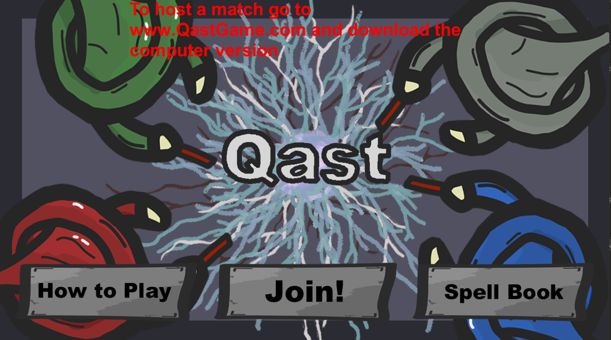

## Connecting and Pre-Game

The desktop app must be opened first. It has one large button to host a game. When a game is hosted it will provide a six digit code made up of integers, this is unique to this instance of the game and can be used by iPhones to connect. IPhones do not need to be on the same network to connect and could connect from anywhere but each iPhone does not have its own view of the game so to play each player should be able to see the main desktop screen.

Once the game code has been inputed into the iPhones the players will join the lobby with a name that they select. From the lobby the players can select their decks. To create a deck the players first select a deck type which will determine how many different types of spells the player can have and how many times they can cast each spell they select. By limiting the amount of spells each player can cast I made it easier for the game to recognize symbols as it has less symbols to check. The different deck types often trade off between variety and quantity. Once a deck is created it can be saved on the iPhone where it will then be available for any future games that the player plays.

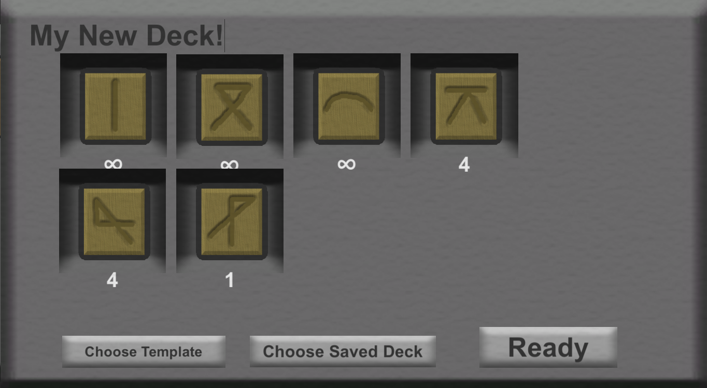

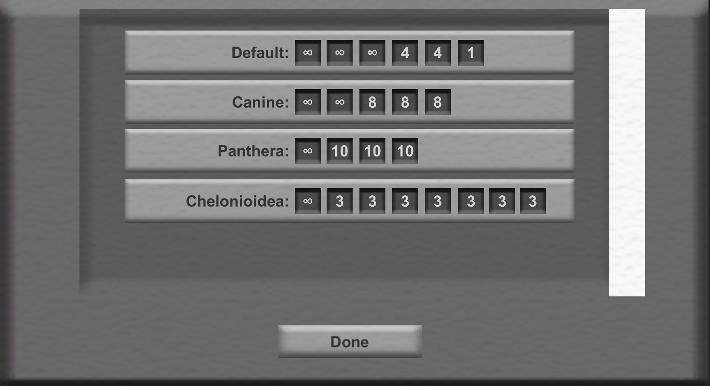

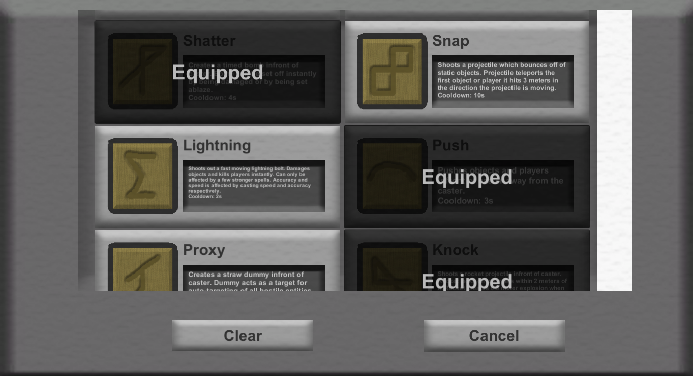

Once ready each player can hit a ready button. The game cannot be started until all the players have hit the ready button. From the desktop the players can also select the maps they want to play on. There are currently two sets, a desert set and a forest set. Each have a total of three maps. Once maps are selected and the players are ready the game can begin.

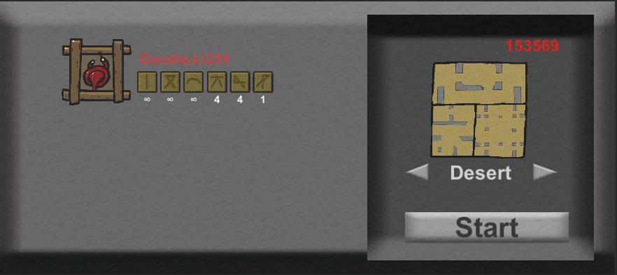

## Main Gameplay

When the game begins all four players are positioned in random corners of one of the three selected maps (Choosen Randomly). The players' phones then are split into two sections. The left section is the joystick section, they can place their finger there to spawn a joystick whcih they can use to move their wizard around. If the joystick is moved only a little the player's wizard will strafe while keeping the enemy infront of them. If the joystick is moved a great deal the wizard will break targeting and start sprinting in the direction of the joystick.

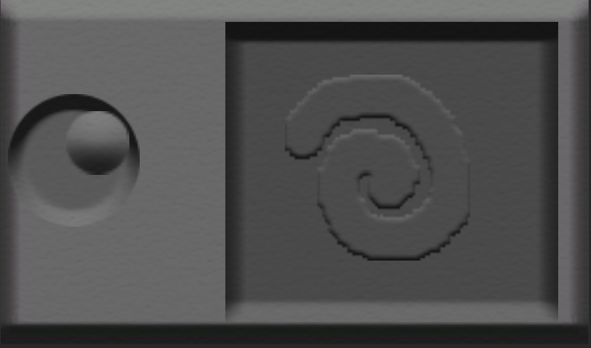

The right section is the casting section. It features one large box that the player can draw in. The player casts a spell by drawing the associated spell's symbol in the right section without lifting their finger. If the symbol is too far off the spell will fizzle and the player's wand will shoot out dust. If the symbol is recogonizable the spell will cast and depending on how well the symbol was drawn the effectiveness of the spell will vary.

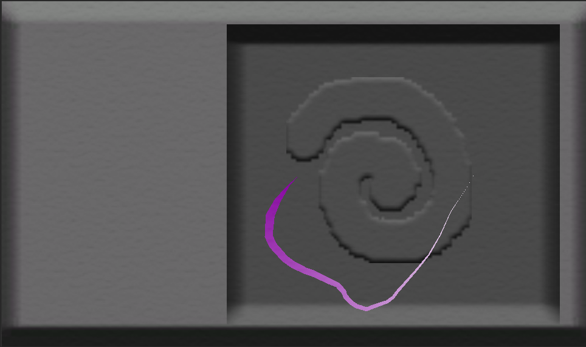

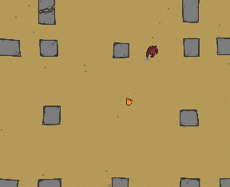

The players can use their various spells to battle it out in the arena. Typically spells are one hit one kill. There are no health bars in this game, rounds are meant to be speedy and vicious. The game rewards creative playing, where spells can be combined into lethal combos. The game was designed in a way that everything can interact with everything else, through a tag system. This means that spells can affect each other in ways that I never directly programmed and there are many beautiful combinations to be found. My favorite is creating a target dummy which can be set alight with another spell and then thrown at the enemy with a gust of wind creating a large fireball.

During the game there are random events that occur. The events are specific to the set of maps selected. On the desert maps, there can be mummies that emerge from the sand and can chase the players around stunning them and there are sandstorms which can push everything on the map in one direction. The forest maps have a series of doors which control the flow of the game. These can be opened and closed by lighting and extinguishing braziers scattered around the map. The events on the forest maps will either randomize all the doors or switch the status of all the doors.

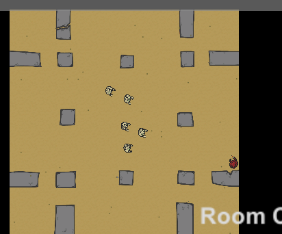

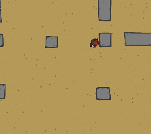

If there are more than two players and a player dies the events are no longer random but can be triggered at random by the eliminated player by spending time that they have been dead. This keeps the game interesting for knocked out players and offers opportunities for satisfying revenge.

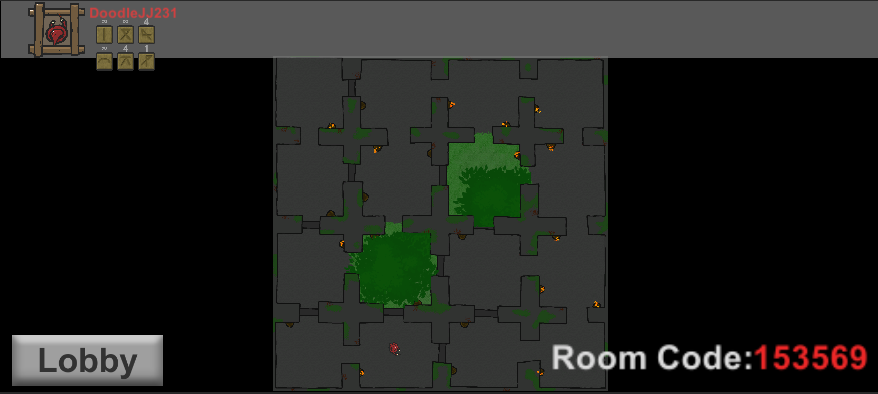

Each full game consists of various rounds rotating on the 3 maps. The last player remaining at the end of each round wins a trophy. The game ends once one player has obtained 4 trophies. It is public information how close players are to winning the game which encourages the other players to gang up on them and balance the game.

Once the game ends all players are returned to the lobby screen and can edit their decks before playing another game.